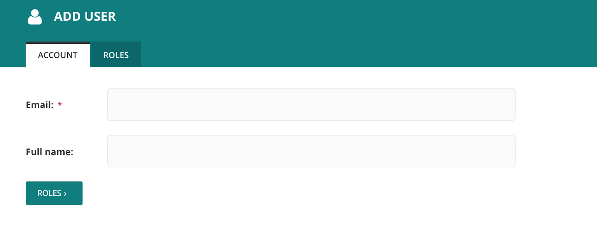

# Create a user account

In the WagTail Admin, you could create a new user role by clicking on the 'Add User' button on the far right-hand corner of the screen. You can also search for users in the search bar.

The 'Add User' form will request your email, name, and role within the platform.

Selecting a role with enable to administrative access within the platform. Commonly used roles within the platform are **Staff**, **Partner**, and **Reviewer**.&#x20;

****

